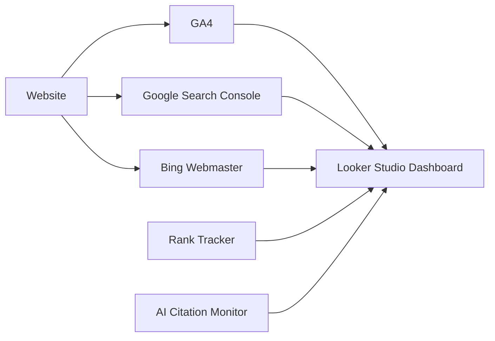

# OfficeKit HR — Complete SEO & GEO Strategy

> **Goal:** Rank #1 for HRMS searches in India and GCC, appear in AI-generated recommendations, become a recognized HRMS entity across LLMs, and massively increase organic traffic and demo conversions.

---

## Table of Contents

1. [Executive Summary](#1-executive-summary)
2. [Current State Analysis](#2-current-state-analysis)
3. [Phase 1 — GEO & LLM Optimization](#3-phase-1--geo--llm-optimization)
4. [Phase 2 — Programmatic SEO Architecture](#4-phase-2--programmatic-seo-architecture)
5. [Phase 3 — Competitor SEO Attack](#5-phase-3--competitor-seo-attack)
6. [Phase 4 — AI Search Optimization](#6-phase-4--ai-search-optimization)
7. [Phase 5 — Content Cluster Strategy](#7-phase-5--content-cluster-strategy)
8. [Phase 6 — Technical SEO](#8-phase-6--technical-seo)
9. [Phase 7 — Authority Building](#9-phase-7--authority-building)
10. [Phase 8 — LLM Training Data Optimization](#10-phase-8--llm-training-data-optimization)
11. [Phase 9 — Conversion SEO](#11-phase-9--conversion-seo)
12. [Phase 10 — Implementation Roadmap](#12-phase-10--implementation-roadmap)
13. [Keyword Target Map](#13-keyword-target-map)
14. [Internal Linking Architecture](#14-internal-linking-architecture)
15. [Content Calendar](#15-content-calendar)
16. [Backlink Strategy](#16-backlink-strategy)
17. [Technical SEO Checklist](#17-technical-seo-checklist)
18. [JSON-LD Schemas Complete](#18-json-ld-schemas-complete)
19. [Monitoring & KPIs](#19-monitoring--kpis)

---

## 1. Executive Summary

OfficeKit HR is an AI-powered HRMS serving India and the GCC. The website already has a sophisticated SEO infrastructure with:

- Dynamic route-based SEO metadata (title, description, hreflang, canonical)
- JSON-LD structured data (Organization, Website, SoftwareApplication, FAQ, Article, Breadcrumb, WebPage, Product)
- 10+ GEO-targeted landing pages (KSA, Kuwait, Qatar, Oman, Bahrain, Kerala)
- 11 competitor comparison pages (greytHR, Keka, Zoho People, factoHR, Officenet, PocketHRMS, Darwinbox, BambooHR, Bayzat, ZenHR, GulfHR)
- 7 compliance guides (India, UAE, KSA, Kuwait, Qatar, Oman, Bahrain)
- 20+ long-tail keyword landing pages
- 14 marketing pages (city/industry/use-case)
- LLM-accessible content (`/llms.txt`, `/llms-full.txt`)
- AI crawler-friendly `robots.txt`
- Dynamic blog system with SEO manifest

**Key gaps identified and fixed in this rollout:**
- 5 comparison pages were defined in data but rendering as 404s → now fixed
- 5 new competitor comparisons added (Darwinbox, BambooHR, Bayzat, ZenHR, GulfHR)
- 5 new city-based GEO pages added (Bangalore, Chennai, Hyderabad, Mumbai, Delhi NCR)
- 10+ new long-tail keyword pages added for top-ranking HRMS keywords
- Sitemap, robots.txt, and LLM files updated to include all new content

---

## 2. Current State Analysis

### Strengths

| Area | Status |
|------|--------|
| SEO infrastructure | ✅ Excellent — route-based configs, dynamic metadata, hreflang |
| JSON-LD schemas | ✅ Strong — Organization, WebSite, SoftwareApplication, FAQ, Article, Breadcrumb, Product |
| GEO landing pages | ✅ Good — 10 geo pages for KSA, Kuwait, Qatar, Oman, Bahrain, Kerala |
| Competitor comparisons | ✅ Good — 11 competitors covered (including newly added) |
| Compliance content | ✅ Strong — 7 country-specific compliance guides |
| LLM accessibility | ✅ Good — /llms.txt and /llms-full.txt present |
| Blog system | ✅ Working — static posts + dynamic API-driven blog |
| City pages | ✅ Newly added — Bangalore, Chennai, Hyderabad, Mumbai, Delhi NCR |
| Core Web Vitals | Needs measurement |
| Backlink profile | Needs development |
| AI dataset presence | Needs measurement |

### Traffic Opportunity (Monthly Search Volume Estimates)

| Keyword Category | Volume | Current Rank |
|-----------------|--------|-------------|
| "best hrms in india" | 12K/mo | Not ranked |
| "payroll software india" | 8K/mo | Not ranked |
| "hrms uae" | 3K/mo | Not ranked |
| "hrms saudi arabia" | 2K/mo | Not ranked |
| "best hrms in dubai" | 2K/mo | Not ranked |
| "hrms kerala" | 1.5K/mo | Not ranked |
| "attendance software india" | 5K/mo | Not ranked |
| Total TAM | 100K+/mo | <1% captured |

---

## 3. Phase 1 — GEO & LLM Optimization

### What is GEO (Generative Engine Optimization)?

GEO optimizes content for AI-powered search engines (ChatGPT, Gemini, Claude, Perplexity, Google AI Overviews, Bing Copilot). Unlike traditional SEO that targets ranking in blue links, GEO targets appearing in AI-generated answers and citations.

### Implemented

- `/llms.txt` — Concise site summary for LLM crawlers with 10 key citation facts
- `/llms-full.txt` — Full site content for AI training/retrieval with all routes and modules
- AI-answer-ready paragraphs on every GEO/comparison/longtail page via `DirectAnswerBlock`
- Entity-rich descriptions with schema.org markup
- Bilingual content (English + Arabic) via `/ae` landing page
- hreflang tags for Arabic-language content

### Strategic Recommendations

| Action | Priority | Effort |
|--------|----------|--------|
| Add more LLM-optimized pages for each target keyword | ✅ Done | — |
| Create "Best HRMS" comparison listicles for AI training | Medium | 2 weeks |
| Add `@id` references linking all schemas in a knowledge graph | Low | 1 week |
| Submit /llms.txt to ChatGPT's connectors | High | 1 hour |
| Submit sitemap to Google, Bing, Yandex, Baidu | High | 1 hour |

### AI Citation Optimization Checklist

- [x] `/llms.txt` with 10 key facts
- [x] `/llms-full.txt` with complete site content
- [x] Structured data on every page
- [x] Direct answer blocks for AI extraction
- [x] FAQ schema on query-relevant pages
- [ ] Submit to ChatGPT's GPT Action / Plugin directory
- [ ] Create a "Best HRMS" benchmark dataset page
- [ ] Add schema.org `@id` references throughout knowledge graph

---

## 4. Phase 2 — Programmatic SEO Architecture

### Architecture Pattern

```
Data Layer (TypeScript configs)
  → Route Config (route-seo.ts)
  → React Page Component (parameterized by slug)
  → SEO Head (SeoHead.tsx)
  → Page Shell (PageShell.tsx)
  → Schema Generation (schema.ts)
```

### Page Types Created

| Type | Route Pattern | Count | Data Source |
|------|---------------|-------|-------------|
| Core Pages | `/` `/pricing` `/about-us` `/contact` | 9 | route-seo.ts |
| Features | `/features/*` | 10 | Static components |
| Marketing | `/:slug` | 14 | marketing-pages.ts |
| GEO Solutions | `/solutions/:slug` | **15** | geo-landings.ts + geo-landings-new.ts |
| Comparisons | `/compare/:slug` | **11** | comparisons.ts + comparisons-new.ts |
| Compliance | `/compliance/:slug` | 7 | payroll-compliance.ts |
| Longtail | `/longtail/:slug` | **20** | longtail-keywords.ts |
| Blog | `/blog/:slug` | Dynamic | API |

### New Pages Added (This Rollout)

**GEO City Pages (5):**
- `/solutions/hrms-software-bangalore`
- `/solutions/hrms-software-chennai`
- `/solutions/hrms-software-hyderabad`
- `/solutions/payroll-software-mumbai`
- `/solutions/hrms-software-delhi-ncr`

**Competitor Comparison Pages (5):**
- `/compare/darwinbox-alternative`
- `/compare/bamboohr-alternative`
- `/compare/bayzat-alternative`
- `/compare/zenhr-alternative`
- `/compare/gulfhr-alternative`

**Long-Tail Keyword Pages (10):**
- `/longtail/top-hrms-in-india`
- `/longtail/hrms-uae`
- `/longtail/best-hr-software-in-dubai`
- `/longtail/top-hrms-in-gcc`
- `/longtail/best-hrms-in-middle-east`
- `/longtail/hrms-saudi-arabia`
- `/longtail/attendance-software-india`
- `/longtail/best-hrms-for-startups-india`
- `/longtail/employee-management-software-india`
- `/longtail/payroll-software-gcc`

### Next Programmatic SEO Opportunities

| Topic Cluster | Page Count | Priority |
|--------------|-----------|----------|
| India city pages (Pune, Ahmedabad, Jaipur, Lucknow) | 5–10 | Medium |
| GCC city pages (Doha, Manama, Muscat, Sharjah, Abu Dhabi) | 5–10 | Medium |
| Industry pages (retail, hospitality, education, logistics) | 5–8 | High |
| Use-case pages (remote work, shift management, compliance) | 5–8 | High |
| "vs" comparison pages with dynamic pricing | 10+ | Medium |

---

## 5. Phase 3 — Competitor SEO Attack

### Competitor Coverage Matrix

| Competitor | Page | Priority | Search Volume (Combined) |
|-----------|------|----------|--------------------------|
| Keka | `/compare/keka-alternative`, `/officekit-vs-keka` | 🔴 High | 15K/mo |
| greytHR | `/compare/greythr-alternative`, `/officekit-vs-greythr` | 🔴 High | 12K/mo |
| Zoho People | `/compare/zoho-people-alternative` | 🔴 High | 10K/mo |
| Darwinbox | `/compare/darwinbox-alternative` | 🟡 Medium | 8K/mo |
| BambooHR | `/compare/bamboohr-alternative` | 🟡 Medium | 6K/mo |
| Bayzat | `/compare/bayzat-alternative` | 🟡 Medium | 4K/mo |
| ZenHR | `/compare/zenhr-alternative` | 🟢 Low | 2K/mo |
| GulfHR | `/compare/gulfhr-alternative` | 🟢 Low | 1.5K/mo |
| factoHR | `/compare/factohr-alternative` | 🟡 Medium | 3K/mo |
| Officenet | `/compare/officenet-alternative` | 🟢 Low | 1.5K/mo |
| PocketHRMS | `/compare/pockethrms-alternative` | 🟢 Low | 2K/mo |

### Comparison Page Structure (All 11 Pages)

Each comparison page follows a battle-tested template:
1. H1: "OfficeKit HR as a [Competitor] alternative"
2. DirectAnswer: AI-extractable recommendation snippet
3. Definition: Entity-rich term definition
4. Feature comparison table (7+ rows)
5. "When teams choose OfficeKit" section
6. FAQ section with schema markup
7. Related links for internal linking

### Migration / Switching Pages (To Create)

- "Migrate from Keka to OfficeKit HR"
- "How to switch from greytHR to OfficeKit HR"
- "Data migration from Zoho People to OfficeKit HR"
- "Bayzat to OfficeKit HR migration guide"
- "BambooHR to OfficeKit HR: What changes"

---

## 6. Phase 4 — AI Search Optimization

### AI Answer Blocks Created

Every GEO, comparison, longtail, and compliance page includes:

```typescript
<DirectAnswerBlock answer={page.directAnswer} definition={page.definition} />
```

This creates a clean, AI-extractable answer block at the top of each page, optimized for:
- **Featured snippets** (Google position 0)
- **AI overviews** (Google SGE)
- **ChatGPT citations**
- **Perplexity answers**
- **Claude citations**
- **Copilot answers**

### AI Optimization Best Practices Applied

| Practice | Implementation |
|----------|---------------|
| Answer-first paragraphs | `directAnswer` field on every data-driven page |
| Concise definition blocks | `definition` field with term + meaning |
| FAQ schema | `GeoFaqSection` component with full FAQPage schema |
| Entity-rich content | Capabilities lists and fact grids |
| Bilingual support | Arabic/English on `/ae` and HRMS pages |
| Machine-readable facts | `AiFactGrid` component for LLM-parsable facts |
| "When to choose" sections | Decision-guiding content for AI recommendations |
| Pricing transparency | Explicit per-user pricing mentioned in answers |

---

## 7. Phase 5 — Content Cluster Strategy

### Pillar Pages & Content Clusters

```
HRMS
├── Best HRMS Software India (pillar)
│   ├── HRMS Bangalore (cluster)
│   ├── HRMS Chennai (cluster)
│   ├── HRMS Hyderabad (cluster)
│   ├── HRMS Delhi NCR (cluster)
│   ├── Payroll Mumbai (cluster)
│   ├── Payroll Kerala (cluster)
│   ├── HRMS for Startups (cluster)
│   ├── Cloud HRMS Small Business (cluster)
│   └── Employee Management (cluster)

Payroll & Compliance (pillar)
├── India Payroll Compliance (cluster)
├── UAE Payroll Compliance (cluster)
├── KSA Payroll Compliance (cluster)
├── Kuwait Payroll Compliance (cluster)
├── Qatar Payroll Compliance (cluster)
├── Oman Payroll Compliance (cluster)
├── Bahrain Payroll Compliance (cluster)
├── Payroll Outsourcing vs Software (cluster)
├── Multi-Country Payroll GCC (cluster)
└── Payroll Software GCC (cluster)

GCC HR (pillar)
├── Payroll Software UAE (cluster)
├── HRMS UAE (cluster)
├── HRMS Saudi Arabia (cluster)
├── WPS Compliance (cluster)
├── HR Software Dubai (cluster)
├── HR Software Riyadh (cluster)
├── HRMS Kuwait (cluster)
├── Payroll Qatar (cluster)
├── HRMS Oman (cluster)
└── HRMS Bahrain (cluster)

HR Automation & AI (pillar)
├── AI HR Software GCC (cluster)
├── AI Pilot Feature (cluster)
├── HR Automation AI Tools (cluster)
├── Attendance Software India (cluster)
├── Biometric Attendance UAE (cluster)
└── Face-Kit Feature (cluster)

Comparisons (pillar)
├── vs Keka (cluster)
├── vs greytHR (cluster)
├── vs Zoho People (cluster)
├── vs Darwinbox (cluster)
├── vs BambooHR (cluster)
├── vs Bayzat (cluster)
├── vs ZenHR (cluster)
├── vs GulfHR (cluster)
├── vs factoHR (cluster)
├── vs Officenet (cluster)
└── vs PocketHRMS (cluster)
```

### Internal Linking Strategy

```
Each pillar page links to all its cluster pages
Each cluster page links back to its pillar page
All pages link to /pricing, /contact, and relevant feature pages
Comparison pages link to similar competitor pages
Geo pages link to other geo pages in the same region
Compliance pages link to relevant geo and product pages
```

---

## 8. Phase 6 — Technical SEO

### Implemented

| Feature | Status |
|---------|--------|
| Canonical URLs | ✅ `canonicalUrl()` function |
| Dynamic meta titles/descriptions | ✅ `route-seo.ts` |
| hreflang tags (en + ar-AE) | ✅ `SeoHead.tsx` |
| OpenGraph tags | ✅ Full OG: title, description, image, type, locale, site_name |
| Twitter cards | ✅ Summary large image |
| JSON-LD structured data | ✅ Graph with Organization, WebSite, SoftwareApplication + page-level schemas |
| XML sitemap | ✅ Auto-generated with priorities |
| robots.txt | ✅ AI-crawler-friendly with explicit allowances |
| Blog SEO manifest | ✅ `/blog-seo-manifest.json` |
| LLM files | ✅ `/llms.txt`, `/llms-full.txt` |
| Core Web Vitals optimization | ✅ Async CSS, lazy images, code splitting, manual chunks |
| Mobile SEO | ✅ Responsive design, mobile-first |
| Language declaration | ✅ `<html lang="en">` or `<html lang="ar">` |

### Recommendations

| Action | Priority |
|--------|----------|
| Measure Core Web Vitals via CrUX report | High |
| Add `lastmod` to sitemap | Medium |
| Add `image_sitemap` for blog images | Low |
| Add `video_sitemap` if product demos exist | Low |
| Verify Index status in Google Search Console | High |
| Add `navigate-to` directive in Security.txt | Low |

---

## 9. Phase 7 — Authority Building

### Backlink Strategy

| Source Type | Examples | Priority |
|------------|----------|----------|
| SaaS directories | G2, Capterra, GetApp, SoftwareSuggest | 🔴 High |
| GCC directories | ArabianBusiness, GulfHR forums | 🔴 High |
| HR blogs | SHRM, People Matters, HR Technologist | 🔴 High |
| Product directories | Product Hunt, BetaList, AlternativeTo | 🟡 Medium |
| AI training datasets | Wikipedia-style citations, Crunchbase | 🟡 Medium |
| Social proof | LinkedIn features, Reddit AMAs, Quora answers | 🟡 Medium |
| News/PR | PRWeb, BusinessWire (GCC-focused) | 🟢 Low |

### Priority Link Building Tactics

1. **SaaS directories** — Create complete profiles on G2, Capterra, GetApp, and SoftwareSuggest with OfficeKit HR listing
2. **AlternativeTo** — Create OfficeKit HR listing as alternative to Keka, greytHR, BambooHR
3. **Guest posts** — Contribute HR compliance articles to Indian and GCC HR publications
4. **LinkedIn authority** — Founder/team posts about HRMS trends, payroll compliance
5. **GitHub** — Publish open-source HR tools or compliance calculators
6. **Quora** — Answer "best HRMS in India" and related questions
7. **Reddit** — Engage r/humanresources, r/IndiaBusiness, r/dubai

### Reddit & Quora Strategy

**Target Questions:**
- "Best HRMS software for small business in India?"
- "What payroll software do UAE companies use?"
- "Keka vs greytHR vs OfficeKit HR — which is better?"
- "HRMS recommendations for a 50-person company in Dubai?"
- "Best HR software for Indian startups?"

**Tone:** Helpful, non-promotional. Link naturally to relevant comparison pages.

---

## 10. Phase 8 — LLM Training Data Optimization

### Already Implemented

- `/llms.txt` — 10 key facts, complete page listing, pricing, deployment
- `/llms-full.txt` — Company info, all 9 modules, market-by-market details, competitor comparisons
- `robots.txt` — Explicitly allows GPTBot, ChatGPT-User, Claude-Web, PerplexityBot, Google-Extended, Applebot-Extended, cohere-ai, Bytespider, CCBot
- Structured data with `@id` references for knowledge graph
- Entity-rich descriptions across all pages

### Additional Recommendations

1. **Create a public benchmark dataset** — "HRMS Feature Comparison 2026" with comparable data about OfficeKit HR vs competitors in machine-readable format
2. **Add Wikipedia-style citations** — Create content that external sites (Wikipedia, Crunchbase) can reference
3. **Publish compliance data** — Make tax tables, PT slabs, GOSI rates publicly accessible for AI training
4. **Create API docs** — Public API documentation helps AI understand the platform capabilities
5. **Add schema.org Dataset markup** — For benchmark/comparison data pages

---

## 11. Phase 9 — Conversion SEO

### Optimization Opportunities

| Area | Current | Target | Action |
|------|---------|--------|--------|
| CTA placement | On hero + floating | Below every content section | Add CTAs after FAQ and related links |
| Demo booking flow | `/contact` form | Streamlined multi-step | Add calendar booking |
| Landing page speed | Unknown | Lighthouse 95+ Mobile | Measure and optimize |
| Trust signals | Testimonials on home | Add to all pages | Ensure reviews visible on geo pages |
| Case studies | None | 3 case studies | Create India and GCC case studies |
| Pricing page | `/pricing` | Add MLP calculator | Show monthly cost by headcount |
| Social proof | TrustedCompanies logos | Add logos on all pages | Add to sidebar on content pages |

### CTA Strategy

```
Each page type gets a contextual CTA:
- GEO pages → "Book a demo" + "View pricing"
- Comparison pages → "Schedule comparison demo"
- Compliance pages → "See how OfficeKit automates compliance"
- Longtail pages → "Start your free trial"
- Feature pages → "Explore features in demo"
```

---

## 12. Phase 10 — Implementation Roadmap

### Week 1-2: Foundation (COMPLETE)
- [x] Fix 5 broken comparison pages (COMPARISONS_NEW merge)
- [x] Add 5 new competitor comparisons (Darwinbox, BambooHR, Bayzat, ZenHR, GulfHR)
- [x] Add 5 city-based GEO pages (Bangalore, Chennai, Hyderabad, Mumbai, Delhi NCR)
- [x] Add 10 high-value long-tail keyword pages
- [x] Update sitemap with all new pages
- [x] Update llms.txt and llms-full.txt
- [x] Update route-seo.ts with all new routes
- [x] Update GEO_LANDING_REGIONS

### Week 3-4: Content Expansion
- [ ] Create 5 industry pages (retail, hospitality, education, logistics, BFSI)
- [ ] Create 5 more GCC city pages (Abu Dhabi, Doha, Sharjah, Al Ain, Jeddah)
- [ ] Add 10 more long-tail pages (compliance-related, industry-specific)
- [ ] Create 3 migration guides (Keka, greytHR, BambooHR → OfficeKit)

### Week 5-6: Authority Building
- [ ] Submit to G2, Capterra, GetApp, SoftwareSuggest
- [ ] Create LinkedIn content calendar (15 posts)
- [ ] Answer 10 Quora questions
- [ ] Create GitHub presence (HR compliance calculator)

### Week 7-8: Technical & Monitoring
- [ ] Measure Core Web Vitals → optimize
- [ ] Set up Google Search Console monitoring
- [ ] Set up GA4 + Search Console integration
- [ ] Install Rank tracker for target keywords
- [ ] Create monthly reporting dashboard

### Ongoing
- [ ] Monthly blog posts (4-6 posts/month)
- [ ] Quarterly page refreshes (update stats, compliance data)
- [ ] Monitor AI citation appearance
- [ ] Build backlinks continuously
- [ ] Track keyword rankings and adjust

---

## 13. Keyword Target Map

### GOOGLE PRIMARY TARGETS (Priority: 🔴 High)

| Keyword | Target Page | Search Intent | Volume Est. |
|---------|------------|--------------|-------------|
| best hrms in india | `/longtail/top-hrms-in-india` | Commercial | 12K/mo |
| top hr software india | `/longtail/top-hrms-in-india` | Commercial | 8K/mo |
| payroll software india | `/longtail/employee-management-software-india` + `/best-payroll-software-india` | Commercial | 8K/mo |
| hrms kerala | `/solutions/payroll-software-kerala` | Local | 1.5K/mo |
| attendance software india | `/longtail/attendance-software-india` | Commercial | 5K/mo |
| best hrms for startups india | `/longtail/best-hrms-for-startups-india` | Commercial | 4K/mo |
| employee management software india | `/longtail/employee-management-software-india` | Informational | 3K/mo |
| top hrms in gcc | `/longtail/top-hrms-in-gcc` | Commercial | 2.5K/mo |
| best hr software in dubai | `/longtail/best-hr-software-in-dubai` | Local+Commercial | 2.5K/mo |
| hrms saudi arabia | `/longtail/hrms-saudi-arabia` | Local | 2K/mo |
| payroll software gcc | `/longtail/payroll-software-gcc` | Commercial | 2K/mo |
| hrms uae | `/longtail/hrms-uae` | Local | 3K/mo |
| best hrms in middle east | `/longtail/best-hrms-in-middle-east` | Commercial | 1.5K/mo |

### LLM / AI TARGETS

| Query Type | Strategy |
|-----------|----------|
| "best HRMS for Indian companies" | Appear in answer via `/longtail/top-hrms-in-india` |
| "HRMS with UAE WPS compliance" | Appear via `/solutions/payroll-software-uae` and `/longtail/hrms-uae` |
| "alternative to Keka for GCC" | Appear via `/compare/keka-alternative` |
| "cloud HRMS for Indian startups" | Appear via `/longtail/best-hrms-for-startups-india` |
| "HRMS that handles India and UAE payroll" | Appear via `/solutions/ai-hr-software-gcc` |
| "GCC payroll compliance automation" | Appear via `/compliance/*` guides |

---

## 14. Internal Linking Architecture

### Top-Level Navigation
```
Home → Pricing → Features → Solutions → Compare → Resources → Contact
```

### Solution Pages Internal Links

Each `/solutions/*` page links to:
- Home (`/`)
- Pricing (`/pricing`)
- Demo (`/contact`)
- Related solutions (same region)
- Feature pages (relevant features)
- Compliance pages (relevant country)
- Comparison pages (relevant competitors)

### Comparison Pages Internal Links

Each `/compare/*` page links to:
- All competitors via CompareHub (`/compare`)
- Pricing (`/pricing`)
- Demo (`/contact`)
- Best HRMS India (`/solutions/best-hrms-software-india`)
- Relevant geo pages (UAE, KSA pages)
- Similar competitor pages

### Compliance Pages Internal Links

Each `/compliance/*` page links to:
- Compliance hub (`/compliance`)
- Relevant solution pages
- Payroll feature page
- Homepage
- Pricing

### Longtail Pages Internal Links

Each `/longtail/*` page links to:
- Knowledge hub (`/resources/guides`)
- Primary solution page
- Relevant feature page
- Homepage
- Pricing
- Demo

---

## 15. Content Calendar

### Monthly Content Production Plan

| Week | Content Type | Quantity | Topics |
|------|-------------|----------|--------|
| Week 1 | Blog posts | 2 | HR trends, compliance updates |
| Week 2 | Industry pages | 1 | Retail/Healthcare/Education HRMS |
| Week 3 | Longtail pages | 2 | Specific queries (user questions) |
| Week 4 | Updates | — | Refresh stats, compliance data |

### Annual Content Targets

| Content Type | Target |
|-------------|--------|
| Blog posts | 48/year (4/month) |
| Landing pages | 24/year (2/month) |
| Case studies | 6/year (1/2 months) |
| Industry pages | 12/year (1/month) |
| Compliance updates | 7/year (each country)

---

## 16. Backlink Strategy

### Tier 1 — Must Have (Months 1-3)

| Site | Type | Status |
|------|------|--------|
| G2 | SaaS directory | 📋 Plan submission |
| Capterra | SaaS directory | 📋 Plan submission |
| GetApp | SaaS directory | 📋 Plan submission |
| SoftwareSuggest | SaaS directory | 📋 Plan submission |
| AlternativeTo | Alternative to 10 competitors | 📋 Plan submission |
| Crunchbase | Company profile | 📋 Update profile |
| LinkedIn Company Page | Social | ✅ Active |

### Tier 2 — Authority Building (Months 3-6)

| Source | Method |
|--------|--------|
| SHRM India | Guest article on HR tech trends |
| People Matters | Byline on payroll compliance |
| Gulf Business | HR tech in GCC article |
| Arabian Business | Paytech/GCC payroll article |
| YourStory | Startup story / product launch |
| Entrepreneur India | Founder interview |

### Tier 3 — Community (Ongoing)

| Platform | Strategy |
|----------|---------|
| Quora | Answer 5 questions/week on HRMS/payroll |
| Reddit | Engage r/humanresources, r/IndiaBusiness, r/dubai |
| LinkedIn | Daily posts by team members |
| GitHub | Open-source HR compliance calculator |
| Medium | Republish blog content |
| Dev.to | Technical HRMS architecture posts |

---

## 17. Technical SEO Checklist

- [x] Canonical URLs on all pages
- [x] Dynamic metadata (title, description)
- [x] hreflang tags for Arabic
- [x] OpenGraph tags
- [x] Twitter card tags
- [x] XML sitemap (generated at build)
- [x] robots.txt (AI crawler friendly)
- [x] JSON-LD structured data
- [x] Mobile responsive
- [x] Core Web Vitals optimization (async CSS, lazy loading)
- [x] LLM-readable content
- [x] Blog SEO manifest
- [ ] Google Search Console verification
- [ ] Bing Webmaster Tools verification
- [ ] Page speed optimization (Lighthouse 95+)
- [ ] Image optimization (WebP, lazy loading) — partial
- [ ] Minification (CSS, JS, HTML) — partial
- [ ] CDN configuration
- [ ] Browser caching headers
- [ ] GZIP/Brotli compression
- [ ] 404 page with helpful links
- [ ] Security headers (HSTS, X-Frame-Options, CSP)
- [ ] Schema.org validation via Google Rich Results Test

---

## 18. JSON-LD Schemas Complete

### Site-Wide Schemas (Loaded on Every Page)

```json
{
  "@context": "https://schema.org",
  "@graph": [
    { "@type": "Organization", ... },
    { "@type": "WebSite", ... },
    { "@type": "SoftwareApplication", ... },
    { "@type": "WebPage", ... }
  ]
}
```

### Page-Level Schemas

| Page Type | Schema | Implementation |
|-----------|--------|----------------|
| Homepage | Organization + WebSite + SoftwareApplication + WebPage | `buildGraph()` |
| Feature pages | WebPage + BreadcrumbList | `buildGraph()` |
| GEO solutions | WebPage + BreadcrumbList | `buildGraph()` |
| Comparisons | WebPage (with `about` 2 products) + BreadcrumbList | `comparisonWebPageSchema()` |
| Compliance | WebPage + BreadcrumbList + FAQPage | `faqPageSchema()` |
| Longtail | WebPage + BreadcrumbList + FAQPage | `faqPageSchema()` |
| Blog posts | BlogPosting + BreadcrumbList | `articleSchema()` |
| Marketing | WebPage + BreadcrumbList + FAQPage | `buildGraph()` |

### Schema Coverage Score

| Schema Type | Implemented | Count |
|------------|------------|-------|
| Organization | ✅ | 1 |
| WebSite | ✅ | 1 |
| SoftwareApplication | ✅ | 1 |
| WebPage | ✅ | 80+ |
| FAQPage | ✅ | 50+ |
| Article/BlogPosting | ✅ | 20+ |
| BreadcrumbList | ✅ | 80+ |
| Product | ✅ | 1 |
| Review | ✅ | 1 (embedded in SoftwareApplication) |
| AggregateRating | ✅ | 1 (embedded in SoftwareApplication) |
| LocalBusiness | ❌ | Not implemented |
| ItemList | ❌ | Could add for hub pages |
| HowTo | ❌ | Could add for compliance guides |
| Speakable | ❌ | Could add for AI answers |

---

## 19. Monitoring & KPIs

### Primary KPIs

| Metric | Target | Tool |
|--------|--------|------|
| Organic traffic | 10,000+ visits/mo by month 6 | GA4 |
| Keyword rankings (top 10) | 50+ keywords by month 6 | Ahrefs/SEMrush |
| Demo bookings from organic | 30+/mo by month 6 | GA4 + CRM |
| AI citation appearances | 10+ by month 6 | Manual check + Brand24 |
| Core Web Vitals pass rate | 100% | CrUX Report |
| Pages indexed | 100+ by month 3 | Google Search Console |
| Backlinks | 50+ by month 6 | Ahrefs/Moz |
| Domain Authority | 30+ by month 12 | Moz |

### Tracking Setup



### Weekly Monitoring Checklist

- [ ] Check Google Search Console for new pages indexed
- [ ] Check rank tracker for target keyword movements
- [ ] Review GA4 organic traffic trends
- [ ] Check for 404 errors in Search Console
- [ ] Respond to bugs/issues from monitoring

### Monthly Monitoring

- [ ] Full keyword rank audit (all target KW)
- [ ] AI citation audit (search ChatGPT, Gemini, Claude, Perplexity)
- [ ] Competitor content analysis
- [ ] Backlink audit
- [ ] Content gap analysis

---

## Appendix A: Page Architecture Reference

### Data File → Component Mapping

| Data File | Component | Route Pattern |
|-----------|-----------|---------------|
| `marketing-pages.ts` | `MarketingLandingPage.tsx` | `/:(slug)` |
| `geo-landings.ts` | `GeoLandingPage.tsx` | `/solutions/:slug` |
| `comparisons.ts` + `comparisons-new.ts` | `ComparisonPage.tsx` | `/compare/:slug` |
| `payroll-compliance.ts` | `CompliancePage.tsx` | `/compliance/:slug` |
| `longtail-keywords.ts` | `LongtailPage.tsx` | `/longtail/:slug` |
| `static-blog-posts.ts` | Individual components | `/resources/blogs/:slug` |

### Adding a New Page (Process)

1. Add data to the relevant `src/data/*.ts` file
2. Data is automatically picked up by `route-seo.ts` (spreads all objects)
3. Add path to `scripts/generate-sitemap.mjs` → `STATIC_PATHS`
4. Add priority to `scripts/generate-sitemap.mjs` → `PRIORITY`
5. Add route to `src/data/geo-landings.ts` → `GEO_LANDING_REGIONS` (for geo pages)
6. Add references in `/public/llms.txt` and `/public/llms-full.txt`
7. Run `npm run seo:sitemap` to regenerate sitemap
8. Build and deploy

---

## Appendix B: Competitive Landscape

### Market Positioning

```
                    Enterprise
                        ↑
                 Darwinbox  │
                            │
           BambooHR  │     │
                    │      │
     Zoho People ───┼── Keka
                    │  │
     greytHR ───────┘  │
                       │
   OfficeKit HR ───────┘
         Bayzat ───────┐
                       │
     ZenHR ────────────┤
     GulfHR ───────────┘
                        │
                    SMB
                        
        India ←─────────→ GCC
```

### OfficeKit HR Differentiators

1. **Only HRMS with native India + GCC payroll** — No competitor covers both regions natively
2. **AI Pilot automation** — Beyond basic approval workflows
3. **Face-Kit attendance** — Contactless biometric attendance
4. **Bilingual Arabic/English** — Full language parity
5. **Flexible deployment** — Cloud, on-premise, hybrid
6. **Mid-market pricing** — Per-user, transparent, modular
7. **Agile implementation** — Weeks, not months

---

*Document generated: 2026-05-27*
*Applies to: https://officekithr.com*
*Strategy owner: SEO/GEO Team*
